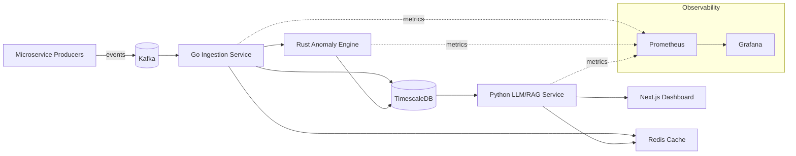

# SentinelOps

**AI-Powered Distributed Log Intelligence & Anomaly Detection Platform**

SentinelOps ingests real-time logs and metrics from distributed microservices, detects anomalies using statistical and ML-based models, and exposes a natural-language query interface (LLM/RAG) for fast incident triage.

## Architecture

## Status
🚧 Early development — see [milestones](docs/MILESTONES.md).

## Local Development
See `infra/docker-compose.yml` (coming in Milestone 1).

## License
MIT — see [LICENSE](LICENSE).