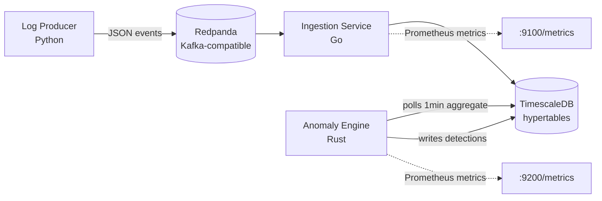

# SentinelOps

**AI-Powered Distributed Log Intelligence & Anomaly Detection Platform**

[](https://github.com/yahiaongh/sentinelops/actions/workflows/ci.yml)

SentinelOps ingests real-time logs from distributed microservices, detects anomalies using statistical models (z-score + EWMA), and will expose a natural-language incident-query interface (LLM/RAG) for fast triage. Built as a polyglot system (Go, Rust, Python) to demonstrate production patterns across the stack: event-driven ingestion, self-migrating services, batched writes, full observability, and a real CI/CD pipeline with branch protection.

## What's actually running today



| Service | Language | Role | Status |
|---|---|---|---|
| `log-producer` | Python | Simulates 4 microservices, injects realistic anomaly bursts | ✅ Running |
| `ingestion-go` | Go | Kafka consumer → batched writes to TimescaleDB, self-migrating schema | ✅ Running |
| `anomaly-rust` | Rust | Polls continuous aggregate, z-score + EWMA anomaly detection | ✅ Running |
| `llm-query-python` | Python | Natural-language RAG query interface over detected anomalies (local Ollama inference) | ✅ Running |
| `dashboard-nextjs` | TypeScript | Real-time anomaly feed, service health, LLM query terminal | ✅ Running |
| Prometheus + Grafana | — | Metrics collection and dashboards for all instrumented services | ✅ Running |

See [docs/MILESTONES.md](docs/MILESTONES.md) for the full roadmap and what's shipped so far. A Kubernetes deployment of the core pipeline (via k3d) is also available — see [infra/k8s/README.md](infra/k8s/README.md).

## Quickstart

Requires Docker and Docker Compose.

```bash
git clone https://github.com/yahiaongh/sentinelops.git
cd sentinelops/infra
cp .env.example .env
docker compose up -d
```

Wait ~20 seconds for health checks, then verify:

```bash
# Confirm all containers are healthy
docker compose ps

# Watch log events land in TimescaleDB
docker exec -it sentinelops-timescaledb psql -U sentinelops -d sentinelops \
  -c "SELECT count(*) FROM log_events;"

# Watch anomalies get detected in real time
docker compose logs -f anomaly-rust

# Browse the raw event stream
open http://localhost:8080   # Redpanda Console
open http://localhost:3001   # Grafana (admin / devpassword by default)
open http://localhost:3000   # SentinelOps dashboard

# Check ingestion service metrics
curl http://localhost:9100/metrics | grep sentinelops

# Check anomaly engine metrics
curl http://localhost:9200/metrics | grep sentinelops
```

## Engineering highlights

A few things in this repo worth a closer look if you're reviewing it:

- **Self-migrating schema, in two languages.** Both `ingestion-go` and `anomaly-rust` embed their SQL migrations at compile time (`go:embed`, `include_str!`) and apply them idempotently on every startup — no manual `psql` step, no drift between environments. This came from a real incident during development: an early version relied on Postgres's `docker-entrypoint-initdb.d`, which silently no-ops on a pre-existing volume. Fixed once, in a way that can't regress.
- **Directional vs. bidirectional anomaly detection.** The anomaly engine originally flagged latency z-scores in both directions, meaning a service running *faster* than its baseline was logged as a "warning" alongside a service running slower. Caught by reading live detection output critically rather than trusting a green build, root-caused, fixed, and covered by a regression test — see `services/anomaly-rust/src/detector/mod.rs`.
- **Idempotent batched writes under at-least-once delivery.** The ingestion service uses `pgx.Batch` to pipeline inserts in a single round trip, with `ON CONFLICT DO NOTHING` on a composite key — verified with a live integration test that duplicate Kafka delivery doesn't create duplicate rows.
- **7-job CI pipeline with branch protection.** Lint + test + build for Go and Rust, lint for Python, a database-integration test against a real TimescaleDB service container, and a Docker build validation for all three images — all required to pass before merge into `main`.

## Local development

Each service also runs standalone for local iteration — see the README in each service directory (`services/<name>/`) for language-specific setup. The full stack is defined in [`infra/docker-compose.yml`](infra/docker-compose.yml).

## License

MIT — see [LICENSE](LICENSE).